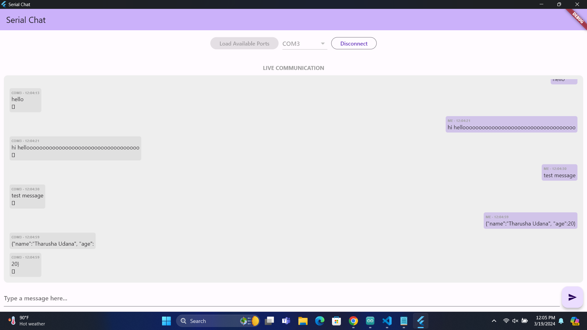

# Serial Chat

Serial Chat is a simple Flutter application for communicating with serial devices in a chatting style. It allows you to select the COM port and baudrate for communication.

## Features

- Select COM port and baudrate
- Communicate with serial devices in a chatting style

## How to Use

1. Clone the repository.
2. Open the project in Flutter.
3. Run the application on your device or emulator.
4. Select the COM port and baudrate.
5. Start chatting with your serial device.

## Dependencies

- [serial_port_win32](https://pub.dev/packages/serial_port_win32) - A Flutter package for serial communication on Windows.

## Screenshots

## Contributions

Contributions are welcome! If you have any ideas or suggestions to improve this application, feel free to submit a pull request.

## License

This project is licensed under the MIT License - see the [LICENSE](LICENSE) file for details.